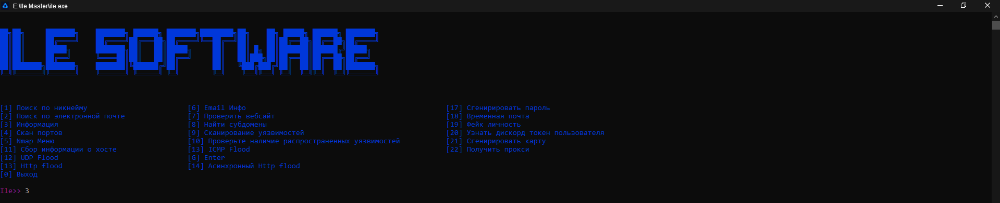

# RU [Инструкция]

1. **Скачиваете** [python](https://www.python.org/)
2. **Устанавливаете модули из requirements.txt | командой pip install -r requirements.txt**
3. **Запускаете ile.exe**

# Команда разработчиков
**iLE Software | iLE OsintWare**

# Лицензия

**ISDN C2386 [Microsoft]**

# Контактная информация
Принятие важных писем dubaifounder@proton.me
Принятие важных диалоговых вопросов [Telegram](https://t.me/drenly)
Активная контактная информация поддержки проекта [Actual](https://t.me/ragotn)

# Example

# EN [Instructions]

1. **Download** [python](https://www.python.org/)
2. **Install modules from requirements.txt | command pip install -r requirements.txt**
3. **Run ile.exe**

# Development Team
**iLE Software | iLE OsintWare**

# License

**ISDN C2386 [Microsoft]**

# Contact information
Accepting important emails dubaifounder@proton.me
Accepting important dialogue questions [Telegram](https://t.me/drenly)

# DE [Anleitung]

1. **Herunterladen** [Python](https://www.python.org/)
2. **Module aus „requirements.txt“ installieren | Befehl pip install -r Anforderungen.txt**
3. **Führen Sie ile.exe aus**

# Entwicklungsteam
**iLE-Software | iLE OsintWare**

# Lizenz

**ISDN C2386 [Microsoft]**

# Kontaktinformationen
Akzeptieren wichtiger E-Mails dubaifounder@proton.me
Annehmen wichtiger Dialogfragen [Telegram](https://t.me/drenly)

# FR [Instructions]

1. **Télécharger** [python](https://www.python.org/)
2. **Installer les modules à partir de Requirements.txt | commande pip install -r exigences.txt**
3. **Exécutez ile.exe**

# Équipe de développement
**Logiciel iLE | iLE OsintWare**

# Licence

**RNIS C2386 [Microsoft]**

# Coordonnées
Accepter les e-mails importants dubaifounder@proton.me
Accepter les questions de dialogue importantes [Telegram](https://t.me/drenly)
